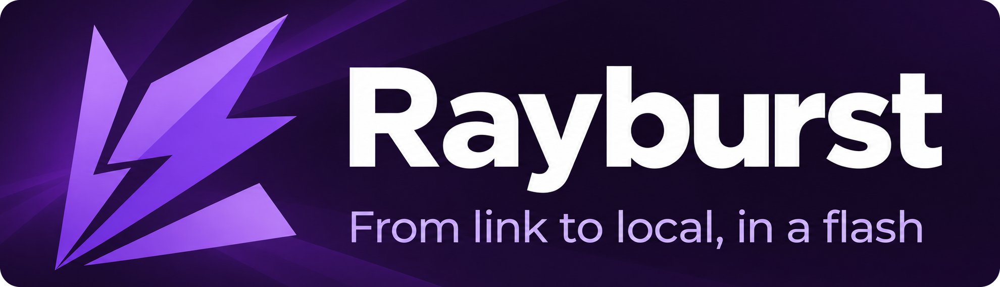

<div align="center">
  
  <br><br>

[](https://github.com/AnInsomniacy/motrix-next/releases)
[](https://github.com/AnInsomniacy/motrix-next/releases)
[](https://github.com/AnInsomniacy/motrix-next/actions/workflows/ci.yml)
[](LICENSE)


**[Download](#download)** · **[Browser extension](https://github.com/AnInsomniacy/motrix-next-extension)** · **[Discussions](https://github.com/AnInsomniacy/motrix-next/discussions)** · **[Build from source](#development)**

<a href="https://trendshift.io/repositories/24525">
  
</a>

</div>

**Rayburst** is a free, open-source download manager for Windows, macOS and Linux.
Manage files, torrents and streaming media in one desktop application, with browser
handoff through **Rayburst Connect**. Built with Tauri, Vue and Rust; powered by
[Aria2 Next](https://github.com/AnInsomniacy/aria2-next).

> [!NOTE]
> The Rayburst rebrand is currently available in source. Public releases still use
> the Motrix Next name; repository addresses are unchanged. The badges above describe
> this repository's published releases and download history. [Build locally](#development)
> to try the current Rayburst interface.

## Download

**[Open GitHub Releases](https://github.com/AnInsomniacy/motrix-next/releases)** for
published installers, prereleases and release notes. Choose the package for your
operating system and processor:

| System                    | Architecture           | Package           | Installation                                            |
| ------------------------- | ---------------------- | ----------------- | ------------------------------------------------------- |
| Windows                   | x64 or ARM64           | NSIS `-setup.exe` | Run the installer and choose the installation scope.    |
| macOS                     | Apple Silicon or Intel | `.dmg`            | Open the disk image and drag the app into Applications. |
| Debian / Ubuntu           | x64 or ARM64           | `.deb`            | Open with your package manager or install with `apt`.   |
| Fedora / RHEL             | x64 or ARM64           | `.rpm`            | Open with your package manager or install with `dnf`.   |
| Other Linux distributions | x64 or ARM64           | `.AppImage`       | Make the file executable, then run it.                  |

The macOS `.app.tar.gz` files are updater packages; use the `.dmg` for a normal
installation. Local Rayburst builds produce `Rayburst`-named installers.
Signing status belongs to the specific release; see [Code signing](docs/CODE_SIGNING.md).

<details>
<summary>Package manager listings</summary>

The existing [Homebrew tap](https://github.com/AnInsomniacy/homebrew-motrix-next),
[Scoop Extras package](https://github.com/ScoopInstaller/Extras/blob/master/bucket/motrix-next.json)
and [FlatPark listing](https://flatpark.org/apps/com.motrix.next/) provide additional
distribution channels for previously published builds. They have not been converted
to Rayburst. Check each listing's version and maintainer before installing.

</details>

## What you can do

| Area                | Capabilities                                                                                                                      |
| ------------------- | --------------------------------------------------------------------------------------------------------------------------------- |
| Files and links     | HTTP, HTTPS and SFTP downloads; BitTorrent, magnet and ED2K tasks; Thunder link handling; batch submission.                       |
| Streaming media     | HLS/DASH inspection, video/audio/subtitle selection, live recording and MP4/MKV output.                                           |
| Task control        | Pause, resume, retry, re-download, choose torrent files, sort tasks and review completed history.                                 |
| Organization        | Favorite and recent folders, optional file-type categories and persistent local task records.                                     |
| Transfer settings   | Concurrent-task and connection limits, global and per-task speed limits, scheduled speed rules and scoped proxies.                |
| BitTorrent          | DHT, peer exchange, encryption controls, tracker management, peer information and sharing controls.                               |
| Desktop integration | Tray operation, native notifications, protocol handlers, keep-awake and completion actions.                                       |
| Appearance          | Light, dark and system themes; Electric Purple and additional color presets; compact task cards, reduced motion and 27 languages. |

**Lightweight mode** releases the WebView when the app minimizes to the tray.
The Rust backend keeps downloads, history, notifications and browser handoff running.

## From the browser to your downloads

[Rayburst Connect](https://github.com/AnInsomniacy/motrix-next-extension) adds download
interception, right-click actions and page media discovery to Chrome, Edge and Firefox.

1. Open Rayburst and find **Extension API** in Advanced Settings.
2. Set the same port and secret in Rayburst Connect. The default port is `29110`;
   use the **Extension API secret**, not the engine RPC secret.
3. Download a file, send a link from the context menu, or select a media source
   from the extension's **Media** tab.

The extension finds sources and supplies browser request context. Rayburst handles
confirmation, task control and history; Aria2 Next performs the transfer. Native
Messaging can activate the installed desktop app when needed.

### HLS, DASH and live media

Add a manifest URL directly or select a source discovered by Rayburst Connect.
Choose the available video, audio and subtitle tracks, then select MP4 or MKV.
Live recordings support a duration limit and **Finish recording and save**.

Media support depends on the source and its codecs. DRM-protected media, arbitrary
webpage extraction and transcoding are not supported. Containers are not encoding
presets; MKV can accommodate subtitle formats that MP4 cannot. See
[Media downloads](docs/MEDIA.md) for selection, recovery and format limits.

## Privacy and diagnostics

No account, advertising or telemetry. Preferences, task history and diagnostic
files are stored locally. Network activity includes requested downloads and enabled
services such as tracker updates and application update checks.

Diagnostic export is available in Advanced Settings. It includes application and
engine logs with sensitive configuration values redacted. Review an archive before
sharing it in a public issue. Read the [Privacy Policy](docs/PRIVACY.md) for storage,
browser request context and network details.

## Common questions

<details>
<summary>Does Rayburst import an existing installation's data?</summary>

No. Rayburst uses its own application identity and data directory. Existing settings,
history and unfinished tasks stay in their original location. Configure Rayburst
and reconnect the browser extension separately; older settings backups and the
previous application protocol are not accepted.

</details>

<details>
<summary>Why are update controls missing from a local build?</summary>

Local builds have no update origin configured by default. Controls appear when a
release is built with its update origin. The updater supports Stable, Beta and Latest
Across Channels policies. See [Releasing](docs/RELEASING.md) for configuration.

</details>

<details>
<summary>Is there a single-file portable Windows build?</summary>

No single-file portable package is provided. Rayburst ships with its download engine
and browser launcher; the installer also registers native browser integration and
file/protocol associations. Use the Windows installer rather than copying only the
application executable.

</details>

## Development

Install Node.js 24, a current stable Rust toolchain and the pnpm version pinned in
`package.json`. Follow the [Tauri platform prerequisites](https://v2.tauri.app/start/prerequisites/)
for your operating system.

```sh
git clone https://github.com/AnInsomniacy/motrix-next.git
cd motrix-next
pnpm install
pnpm tauri dev
```

Build an installer with `pnpm tauri build`. The native launcher is built by Tauri's
existing build hook. Each target needs its matching bundled Aria2 Next sidecar;
the engine and extension are maintained in their own repositories.

| Command                                                                      | Purpose                                              |
| ---------------------------------------------------------------------------- | ---------------------------------------------------- |
| `pnpm build`                                                                 | Type-check and build the frontend.                   |
| `pnpm lint` / `pnpm format:check`                                            | Check source style and formatting.                   |
| `pnpm check:repo`                                                            | Check locale structure and placeholders.             |
| `pnpm test`                                                                  | Run frontend behavior tests.                         |
| `cargo check --manifest-path src-tauri/Cargo.toml --workspace --all-targets` | Check native targets.                                |
| `cargo test --manifest-path src-tauri/Cargo.toml --workspace --all-targets`  | Run native tests.                                    |
| `pnpm brand:assets`                                                          | Generate desktop and tray icons from the SVG source. |

The desktop logo lives in `src/assets/rayburst.svg`; the README banner is a separate
asset in `docs/media/`. UI colors use the existing Material Color Utilities theme
system. The website remains outside this branding change.

Tests and builds belong to this repository. Browser-to-desktop acceptance is performed
manually with independently built applications. Full checks, contribution rules and
release procedures are documented below.

## Documentation and community

- [Contributing](docs/CONTRIBUTING.md) · [Code of Conduct](docs/CODE_OF_CONDUCT.md)
- [Download ownership](docs/DOWNLOADS.md) · [Media downloads](docs/MEDIA.md)
- [Versioning and releases](docs/RELEASING.md) · [Code signing](docs/CODE_SIGNING.md)
- [Report a bug](https://github.com/AnInsomniacy/motrix-next/issues) · [Discuss an idea](https://github.com/AnInsomniacy/motrix-next/discussions)
- [Support development](https://github.com/AnInsomniacy/AnInsomniacy/blob/main/SPONSOR.md)

For bug reports, include your app version, operating system, reproduction steps and
relevant diagnostics. Keep credentials and private download URLs out of public posts.

## License

[MIT](LICENSE) — Copyright © 2025–present AnInsomniacy.
Bundled dependencies retain their own licenses and notices.
